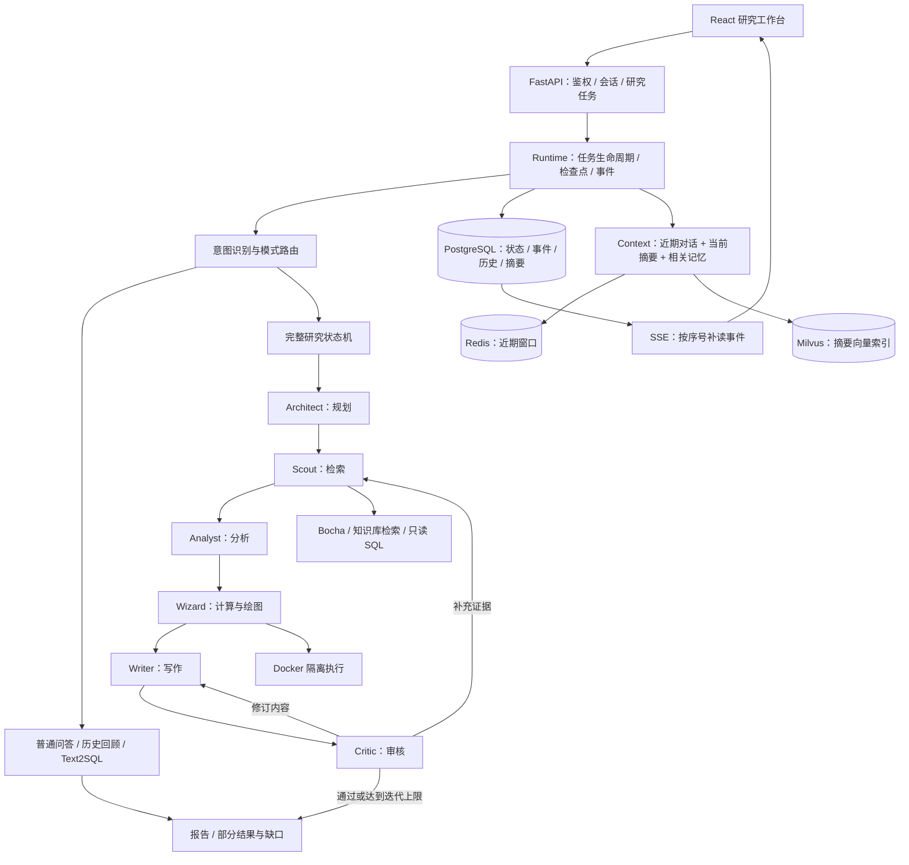
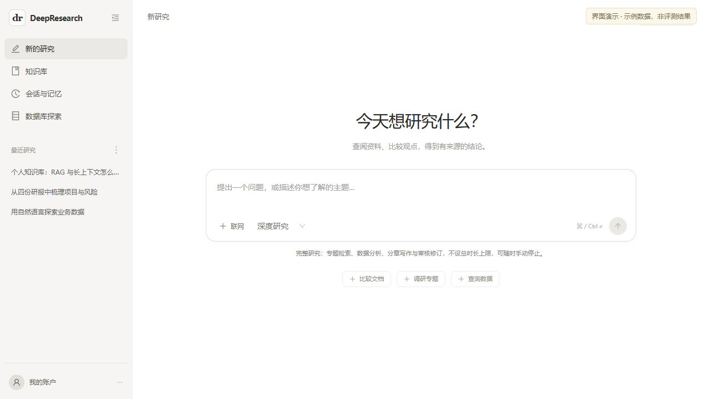
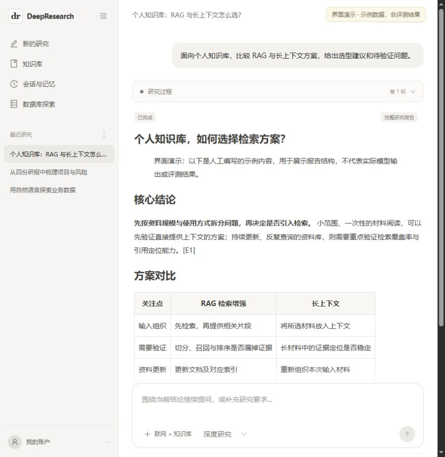
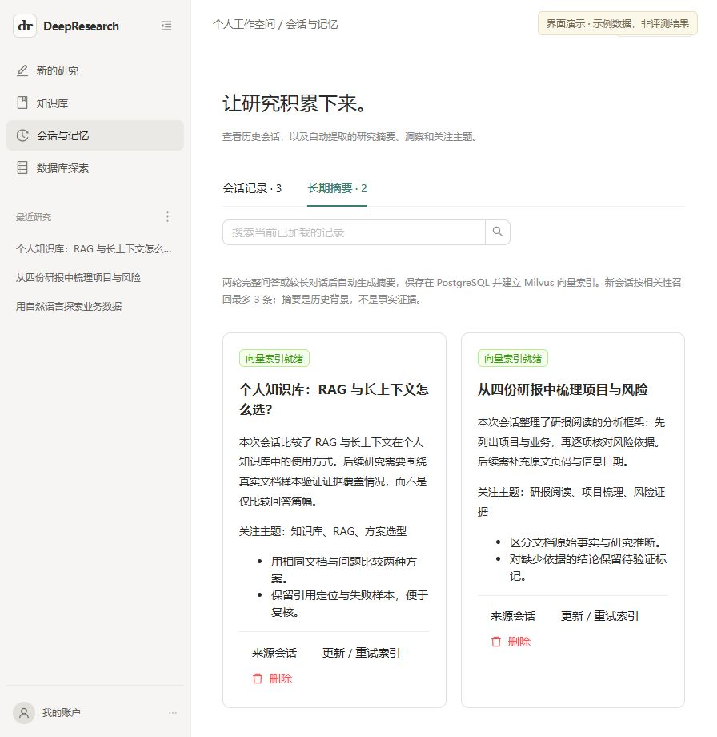

# DeepResearch

### 面向个人资料与业务数据的多 Agent 研究系统

基于 FastAPI 与 React 构建的研究型 Agent 应用，将任务规划、多源检索、数据分析、沙箱绘图、报告生成和审核修订组织为可追踪、可恢复的执行流程。支持知识库检索、只读 Text2SQL，以及跨会话的分层记忆。

项目重点在于 **Agent 的执行控制与工程可靠性**：如何限制工具权限、管理研究状态、处理长任务中断、维护证据来源，以及在上下文预算内复用历史研究。

**技术栈：** Python / FastAPI / asyncio / React / TypeScript / PostgreSQL / Redis / Milvus / SSE / Docker

[系统架构](#系统架构) · [关键设计](#关键设计) · [验证与测试](#验证与测试) · [界面展示](#界面展示) · [本地运行](#本地运行)

## 项目背景

面向研报分析、专题调研和业务数据分析，系统需要同时处理非结构化文档、公开搜索结果与结构化数据。单次模型调用难以覆盖持续检索、证据核对、长报告写作和失败恢复等需求。

本项目将研究过程拆分为具有明确输入、输出和状态的阶段，通过统一运行时管理 Agent 与工具；将研究事实、会话背景和运行时对象分别处理，避免仅依赖不断增长的对话记录驱动整个流程。

| 能力 | 实现范围 |
| --- | --- |
| 深度研究 | 规划大纲、按章节检索、分析与绘图、分章写作、审核及补查 / 修订 |
| 知识库 | 文档上传、DocMind 解析、向量入库、限定用户及资料范围的检索 |
| 会话与记忆 | 完整历史持久化、近期上下文窗口、结构化摘要、跨会话语义召回 |
| 数据库探索 | 业务表浏览、自然语言生成受限只读 SQL、查询结果作为研究证据 |

## 系统架构



系统由 **Python 异步状态机**统一调度规划、检索、分析、绘图、写作和审核六类 Agent。主要阶段按依赖顺序执行，章节检索分批并发；审核结果驱动补充检索或内容修订。研究编排入口为 [`assistant/full_research.py`](backend/app/service/assistant/full_research.py)，任务生命周期与恢复由 [`assistant/runtime.py`](backend/app/service/assistant/runtime.py) 管理。

## 关键设计

### 1. 意图路由与审核闭环

根据用户指定模式及问题意图，区分完整研究、普通问答、历史回顾和 SQL 查询。历史回顾优先使用会话与记忆上下文，完整研究进入六角色流程。

各角色共享研究大纲、事实与来源快照、章节草稿、图表及审核记录。审核不通过时，根据问题进入补充检索或内容修订分支；初审后最多追加三次补查 / 修订，达到上限仍有缺口时保留部分结果及原因。

审核通过要求同时满足模型给出 `pass`、评分至少 7 分，以及不存在 `critical` / `major` 问题。该判定用于流程控制，评分本身不作为报告准确率或客观质量指标。

**代码：** [意图控制器](backend/app/service/assistant/controller.py) · [研究状态机](backend/app/service/assistant/full_research.py) · [角色实现](backend/app/service/deep_research_v2/agents)

### 2. 长任务生命周期与阶段恢复

HTTP 请求负责创建任务和订阅结果，运行时通过后台异步任务执行研究。角色事件经 `asyncio.Queue` 汇入统一流程，阶段事件与状态落库后通过 SSE 展示；同步上下文读取通过 `asyncio.to_thread` 移出事件循环。

- **持久化检查点：** PostgreSQL JSONB 保存阶段状态、来源快照和章节产物，队列等运行时对象不进入持久化数据。
- **订阅与执行分离：** 浏览器断连不会取消研究，SSE 使用递增 `seq`，支持通过 `after=N` 补读事件。
- **结果一致性：** 最终报告、任务终态与助手消息在同一事务写入，通过 `run_id` 避免重复保存结果消息。
- **中断恢复：** 后端启动时将遗留活动任务标记为 `interrupted`，恢复时继续已提交的阶段；未提交的外部请求可能重试。
- **调用边界：** 完整研究不设总时长上限，单次模型请求默认限制为 600 秒，覆盖持续流式输出；工具执行与审核迭代分别受限。

运行状态包括 `queued`、`running`、`completed`、`partial`、`failed`、`cancelled` 和 `interrupted`。当前为单进程运行时，未实现分布式调度或外部调用的 exactly-once 语义。

**代码：** [任务运行时](backend/app/service/assistant/runtime.py) · [HTTP / SSE 接口](backend/app/router/assistant_router.py) · [模型网关](backend/app/service/assistant/llm.py)

### 3. 分层记忆与上下文预算

原始会话、压缩摘要和检索索引分别承担不同职责。滑动窗口只裁剪提供给模型的上下文，不删除历史消息。

| 层次 | 存储与策略 | 异常处理 |
| --- | --- | --- |
| 近期对话 | Redis 缓存最近消息，按 Token 估算预算从新到旧选取上下文 | 缓存失效或不可用时，从 PostgreSQL 恢复 |
| 当前会话摘要 | LLM 增量提取摘要、关键洞察、关注主题与未解决问题，保存到 PostgreSQL | 摘要失败不推进处理游标 |
| 跨会话记忆 | Milvus 建立摘要向量索引，按相关性召回同一用户的历史摘要 | 核对记录归属、修订版本与删除状态；索引失败保留摘要并支持重试 |

默认两轮完整问答或新增内容达到约 1,600 Token 后触发摘要；近期对话窗口约 3,000 Token，当前摘要约 1,200 Token，跨会话最多召回 3 条。Token 使用 `cl100k_base` 估算，不能视为所有供应商模型的精确计数。记忆作为背景上下文注入，不进入事实证据集合。

**代码：** [上下文组装与摘要](backend/app/service/assistant/memory_context.py) · [缓存与向量索引](backend/app/service/assistant/memory_store.py)

### 4. 工具约束与代码隔离

| 执行边界 | 机制 |
| --- | --- |
| 资料访问 | 工具调用遵循用户选择的来源范围；知识库及会话数据按用户过滤 |
| SQL 查询 | 限定业务表与语法子集，核验执行计划中的关系，使用只读事务、执行超时与返回行数限制 |
| 代码执行 | 每次创建独立 Docker 容器：断网、非 root、只读根目录，不挂载宿主目录和 Docker socket，不注入项目密钥 |
| 资源限制 | 默认 1 CPU、512 MB 内存、32 个进程、60 秒超时；限制文本与图片输出，取消或超时后清理容器 |
| 失败处理 | 缺失沙箱镜像时明确失败，不使用宿主 Python 兜底执行生成代码 |

**代码：** [工具入口](backend/app/service/assistant/tools.py) · [SQL 策略](backend/app/service/assistant/sql_policy.py) · [沙箱执行器](backend/app/service/deep_research_v2/sandbox.py)

### 5. 证据与图表的数据约束

检索结果保存为来源快照，报告引用映射为证据编号；仅实际获取的来源进入事实集合。绘图前校验数据点的数值、单位、年份及引用原句，检查统计口径与期间一致性，区分实际值、预测值和目标值。

缺少符合约束的数据时保留缺口，不为凑齐图表数量补造数据。引用编号校验及原句匹配能够发现部分结构性错误，但不能替代事实语义核验与来源可靠性判断。

**代码：** [图表数据契约](backend/app/service/deep_research_v2/chart_contract.py) · [报告与图表展示](frontend/src/pages/research/full-report-details.tsx)

## 验证与测试

测试侧重执行约束、异常分支和状态一致性。模型或专家替身用于确定性故障测试；数据库与 Docker 相关用例需要本地依赖。以下为现有测试覆盖范围，不代表对真实报告质量完成了基准评测。

| 测试入口 | 主要检查内容 |
| --- | --- |
| [发布接口](backend/app/scripts/test_app_routes.py) | 核心路由注册、旧入口移除、健康检查与未登录访问边界 |
| [研究编排](backend/app/scripts/test_full_research.py) | 章节覆盖、审核修订、阶段恢复、取消时回收并发任务 |
| [任务运行时](backend/app/scripts/test_personal_runtime.py) | 结果去重、已提交步骤恢复、取消后禁止写入、额度与超时错误 |
| [分层记忆](backend/app/scripts/test_layered_memory.py) | 缓存回填、Token 窗口、增量摘要、用户隔离、删除与索引重试 |
| [模型网关](backend/app/scripts/test_model_gateway.py) | 流式拼接、空响应与 JSON 错误、截断识别、整次请求超时 |
| [图表契约](backend/app/scripts/test_chart_contract.py) | 虚构数值、混合单位、跨期间混用、预测值冒充实际值 |
| [Docker 沙箱](backend/app/scripts/test_research_sandbox.py) | 禁网、宿主文件不可见、只读文件系统、资源上限与取消清理 |

在已准备依赖的 Python 环境中，可从项目根目录分别运行：

```powershell
python backend/app/scripts/test_model_gateway.py
python backend/app/scripts/test_chart_contract.py
python backend/app/scripts/test_personal_runtime.py
python backend/app/scripts/test_layered_memory.py
python backend/app/scripts/test_research_sandbox.py
```

运行时与记忆测试创建隔离测试记录，需要 PostgreSQL / Redis 配置；沙箱测试使用本机已有的 `python:3.11-slim` 镜像，不自动下载。确定性用例通过说明对应机制满足断言，报告质量仍需使用真实任务单独评估。

## 界面展示

研究工作台提供模式选择、资料范围控制和历史会话入口。



<details>
<summary>查看报告阅读与长期摘要管理</summary>

报告展示章节、引用编号和研究过程；长期摘要管理展示来源会话、关注主题与关键洞察。





</details>

截图使用当前前端组件与演示数据，展示完成状态及报告内容均不作为真实验收结果。[截图说明与复现入口](assets/readme/README.md)

## 本地运行

当前启动脚本面向 Windows 已配置环境，使用现有 Python / Node 依赖与 Docker 镜像。首次下载需准备依赖，复制配置模板并填写本机路径和服务参数。

```powershell
# 在项目根目录执行；已存在配置时保留原文件
if (!(Test-Path services.local.psd1)) { Copy-Item services.local.example.psd1 services.local.psd1 }
if (!(Test-Path backend/.env)) { Copy-Item backend/.env.example backend/.env }
if (!(Test-Path frontend/.env)) { Copy-Item frontend/.env.example frontend/.env }

# 编辑配置并启动 Docker Desktop 后，启动本项目服务
powershell -NoProfile -ExecutionPolicy Bypass -File .\start.ps1

# 停止服务，保留数据卷
powershell -NoProfile -ExecutionPolicy Bypass -File .\stop.ps1

# 更换同一 API 提供方的模型 ID，并重启后端
powershell -NoProfile -ExecutionPolicy Bypass -File .\set-model.ps1 -ModelId '你的模型ID'
```

前端：[127.0.0.1:5183](http://127.0.0.1:5183/)；后端连通检查：[127.0.0.1:8000/hello](http://127.0.0.1:8000/hello)。

核心配置包括模型的 `DASHSCOPE_API_KEY` / `DASHSCOPE_BASE_URL` / `OPENAI_MODEL`、Bocha 搜索密钥、DocMind 凭据、PostgreSQL / Redis / Milvus 连接与 `JWT_SECRET_KEY`。设置 `LLM_BASE_URL` 时它优先；`OPENAI_MODEL` 不控制 Embedding / Rerank 模型。配置模板见 [backend/.env.example](backend/.env.example)，启停说明见 [自用启停.md](自用启停.md)。

分析绘图使用 `industry-research-sandbox:local` 镜像。首次构建前需准备 Docker 并允许安装镜像内依赖：

```powershell
docker build --pull=false -t industry-research-sandbox:local backend/sandbox
```

`.env`、本地路径配置、用户资料、运行日志与 `docs/` 不纳入仓库；运行数据保存在本机及 Docker 数据卷中。

## 适用范围与后续工作

- **研究质量：** 当前采用模型审核和结构化约束，尚无固定评测集上的质量、时延、成本对比。下一步应记录证据覆盖、引用支持、任务完成率及每任务调用成本。
- **信息获取：** 网页检索包含搜索摘要，未覆盖所有来源的全文抓取；研究模板对不同题型的适配仍需完善。
- **数据接入：** Text2SQL 当前限定 `industry_stats`、`company_data`、`policy_data` 三张业务表；本机演示数据为虚构样本，尚无通用数据源连接管理。
- **运行扩展：** 当前为单进程部署，可进一步引入持久任务队列与多工作进程调度；本地部署仍依赖外部模型、搜索与解析服务。
