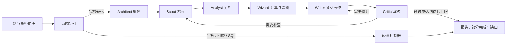

# DeepResearch · 个人研究助手

**把个人资料、公开信息与业务数据，整理成有来源、可追问的研究结论。**

上传研报、提出问题、选择资料范围，助手会规划研究、查找证据、分析数据、撰写报告并审核修订。研究过程、引用和会话会被保存，下一次可以接着研究。

`多角色研究编排` · `知识库检索` · `只读 Text2SQL` · `分层记忆` · `SSE 过程展示` · `Docker 代码沙箱`


> 本页截图由当前前端组件渲染，使用人工编写的示例数据；用于展示交互与布局，不代表真实研究结果或质量评测。[截图说明](assets/readme/README.md)

## 可以用它做什么？

| 你想做的事 | 使用入口 | 得到什么 |
| --- | --- | --- |
| 研究一个行业、公司或技术专题 | 深度研究 | 分章节报告、引用来源、研究过程与待验证问题 |
| 从自己的研报、文档里找答案 | 知识库 | 文档解析与向量检索，可在问答或研究中引用资料 |
| 接着上次的结论继续问 | 会话与记忆 | 完整历史、自动摘要、跨会话相关内容召回 |
| 不写 SQL 也能查看业务数据 | 数据库探索 | 业务表浏览、自然语言转只读 SQL、查询结果 |

例如：比较几份研报的观点、梳理某家公司的项目与风险，或围绕一个技术问题整理方案差异与证据缺口。数据库查询结果也可以作为研究证据。

## 从一个问题开始

1. **准备资料。** 在知识库上传文档，等待解析与入库完成；只研究公开信息时可直接使用联网检索。
2. **明确问题。** 选择资料范围与模式，说明研究对象、时间范围和期望产物。需要完整报告时选择「深度研究」。
3. **检查并继续。** 查看研究过程、报告引用与缺口；在同一会话中追问，或在「会话与记忆」查看历史与摘要。

可以这样提问：

```text
基于我选中的四份研报，梳理华电科工涉及的项目、业务机会和主要风险。
请区分原文事实与分析推断，标明来源；资料不足的地方单独列出。

面向个人知识库，比较 RAG 与长上下文方案。
请从资料更新、引用定位与实现成本三个维度分析，并给出验证方案。
```

「自动识别」会尝试区分普通问答、历史回顾、数据库查询与研究任务；也可以手动指定模式。自动识别仍可能误判。

## 看看它如何呈现结果

### 报告与研究过程

报告按章节组织，保留证据编号；研究过程可以展开查看。具备合适的可核验数值时，流程还会生成图表，并展示数据点与检索原句。


### 会话与长期摘要

原始对话留在历史中，摘要另行保存。摘要包含关键洞察与关注主题，后续会话按相关性召回，帮助延续研究背景。


## 设计上的几个重点

### 1. 六个角色，围绕同一份研究状态协作

规划、检索、分析、绘图、写作、审核分别负责不同阶段，共享大纲、证据、章节草稿与审核结果。审核发现缺口后，可以回到补充检索或内容修订，初审后最多追加三次补查 / 修订。



当前主链路使用 **Python 异步状态机**编排六个角色，检索阶段有分批并发；不是六个独立服务同时运行，也不是直接使用旧版 LangGraph 图执行。入口见 [runtime.py](backend/app/service/assistant/runtime.py)，完整流程见 [full_research.py](backend/app/service/assistant/full_research.py)。

### 2. 研究不依赖浏览器一直打开

后台运行任务，SSE 向前端推送阶段事件；PostgreSQL JSONB 保存研究状态、事件和报告。事件按序号补读，刷新页面可以恢复已保存的展示内容。

- 浏览器断开不会主动取消任务，可以手动停止研究。
- 后端重启会中断运行；已保存阶段保留，用户可从会话中恢复，未提交的步骤可能重做。
- **完整研究没有 30 分钟总时长上限**，仍保留单次模型调用、工具执行与审核迭代的限制。

### 3. 记忆分层，历史不会因窗口裁剪而删除

| 层次 | 存在哪里 | 作用 |
| --- | --- | --- |
| 近期对话 | Redis | 缓存最近对话，按滑动窗口与 Token 估算预算提供上下文；缓存不可用时从数据库恢复 |
| 完整历史与长期摘要 | PostgreSQL | 保留原始会话；LLM 提取摘要、关键洞察和关注主题，持久化结构化记录 |
| 跨会话召回 | Milvus | 为摘要建立向量索引，按当前问题召回同一用户的相关历史摘要 |

默认在两轮完整问答或新增内容达到约 1,600 Token 后生成摘要，跨会话最多召回 3 条。记忆是历史背景，不充当事实证据；当前不围绕手动用户偏好开展记忆管理。[记忆实现](backend/app/service/assistant/memory_context.py) · [回归测试](backend/app/scripts/test_layered_memory.py)

### 4. 给工具明确的执行边界

- **SQL 查询：** 受限语法与业务表范围、执行计划核验、只读事务、执行超时与返回行数限制。
- **分析代码：** 在临时 Docker 容器执行，断网、非 root、只读根目录，不挂载宿主目录、不传入项目密钥；默认 1 CPU、512 MB 内存、60 秒超时，执行后清理容器。
- **研究图表：** 检查数值、单位、年份与检索原句的匹配，保留数据来源；缺少合格数据时允许不画图，不保证每次固定生成几张。

沙箱镜像缺失时明确报错，不回退到宿主 Python。[沙箱实现](backend/app/service/deep_research_v2/sandbox.py) · [隔离测试](backend/app/scripts/test_research_sandbox.py)

## 启动与模型切换

以下适用于已配置好的 **Windows 本机环境**。先打开 Docker Desktop，再进入包含 `start.ps1` 的项目根目录执行。

```powershell
# 启动本项目服务
powershell -NoProfile -ExecutionPolicy Bypass -File .\start.ps1

# 停止本项目服务，保留数据库与数据卷
powershell -NoProfile -ExecutionPolicy Bypass -File .\stop.ps1

# 重启前后端
powershell -NoProfile -ExecutionPolicy Bypass -File .\restart.ps1

# 更换同一 API 平台的模型 ID，并重启后端
powershell -NoProfile -ExecutionPolicy Bypass -File .\set-model.ps1 -ModelId '你的模型ID'
```

前端：[http://127.0.0.1:5183/](http://127.0.0.1:5183/) · 后端连通检查：[http://127.0.0.1:8000/hello](http://127.0.0.1:8000/hello)

脚本复用已有 Python / Node 环境和 Docker 镜像，不自动安装依赖。首次部署或换电脑，需要先准备环境将 `services.local.example.psd1` 复制为 `services.local.psd1` 并调整路径；完整说明见 [自用启停.md](自用启停.md)。数据主要保存在 Docker 卷中，复制代码目录不等于备份数据。

### 哪些配置需要填写？

后端读取 `backend/.env`，字段参考 [backend/.env.example](backend/.env.example)。只修改模型名称时使用上面的 `set-model.ps1` 即可，无需逐个修改 Agent。

| 配置 | 用途 |
| --- | --- |
| `DASHSCOPE_API_KEY`、`DASHSCOPE_BASE_URL`、`OPENAI_MODEL` | 模型调用；更换供应商时需同时检查密钥与地址。如设置 `LLM_BASE_URL`，它优先于默认地址 |
| `BOCHA_API_KEY` | 联网搜索 |
| `DOCMIND_ACCESS_KEY_ID`、`DOCMIND_ACCESS_KEY_SECRET` | DocMind 文档解析，使用知识库上传时需要 |
| `POSTGRES_*`、`REDIS_*`、`MILVUS_*` | 数据与缓存服务连接，应与本地部署一致 |
| `JWT_SECRET_KEY` | 登录令牌签名 |
| `RESEARCH_SANDBOX_IMAGE` | 分析代码使用的沙箱镜像，默认 `industry-research-sandbox:local` |

`OPENAI_MODEL` 统一控制研究角色、问答、SQL 与摘要模型，不会更改 Embedding / Rerank 模型。模型切换成功表示配置已保存，是否有调用权限与额度仍需实际验证。不要将真实 `.env` 或密钥提交到仓库。

需要首次构建绘图镜像时，在确认已有 Docker 环境并允许安装镜像内依赖后执行：

```powershell
docker build --pull=false -t industry-research-sandbox:local backend/sandbox
```

## 技术与代码入口

**前端：** React 19 · TypeScript · Vite · Ant Design · ECharts  
**后端：** Python · FastAPI · asyncio · SSE  
**数据与执行：** PostgreSQL · Redis · Milvus · Docker  
**外部能力：** 兼容接口的大模型 · Bocha 搜索 · DocMind 文档解析

```text
backend/app/service/
  assistant/             意图识别、运行时、完整研究、工具与记忆
  deep_research_v2/       六个研究角色与代码沙箱
frontend/src/pages/
  research/              研究工作台、报告、会话与记忆
  knowledge/             知识库管理
  database/              数据库探索
backend/sandbox/         沙箱镜像与执行依赖
assets/readme/          README 展示图（示例数据）
scripts/                本机服务管理实现
.runtime/               本机运行状态和日志
```

## 当前边界

- **研究质量需复核。** 模型审核与引用编号检查不等于事实核验；联网检索包含搜索结果摘要，不能视为所有网页均已全文读取。研究模板对不同题型的适配仍需继续完善。
- **数据库范围有限。** 当前支持 `industry_stats`、`company_data`、`policy_data` 三张业务表，尚无通用多数据源连接管理；本机样例数据是虚构数据。
- **部署以单机为主。** 运行时任务由单进程管理，尚未实现分布式任务队列；检查点恢复不保证外部请求恰好执行一次。
- **本地部署不等于离线运行。** 模型、搜索和文档解析依赖外部服务；生成结果的完整度受资料范围、接口可用性和模型能力影响。

代码与验证入口：[完整研究](backend/app/service/assistant/full_research.py) · [分层记忆](backend/app/scripts/test_layered_memory.py) · [业务数据查询](backend/app/scripts/test_business_demo.py) · [运行时恢复](backend/app/scripts/test_personal_runtime.py)
