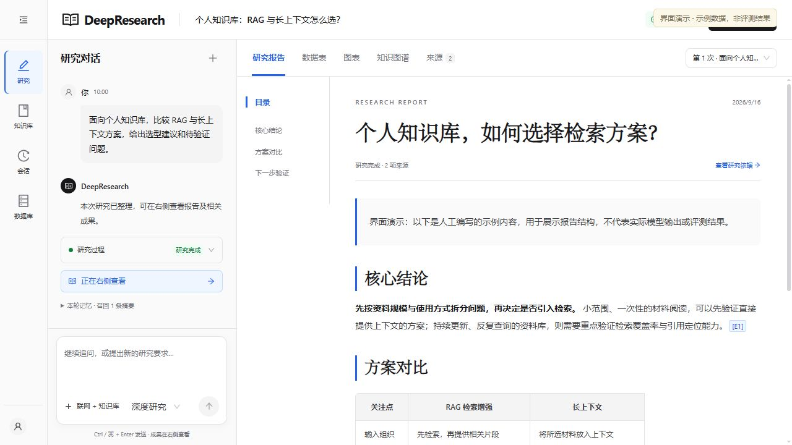
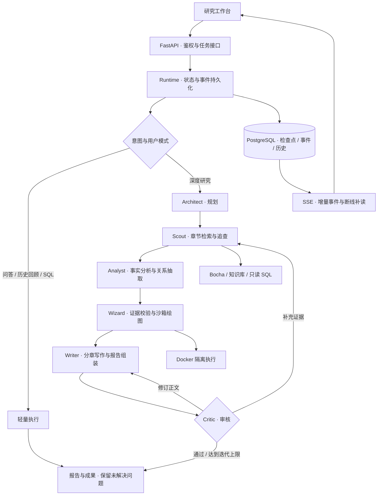
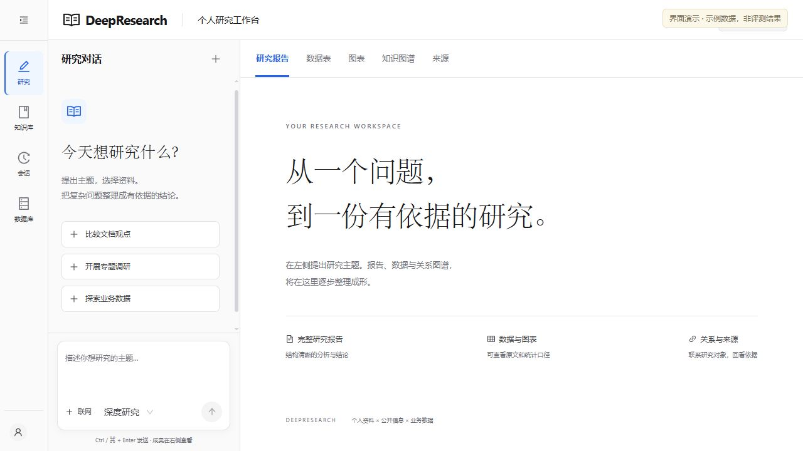
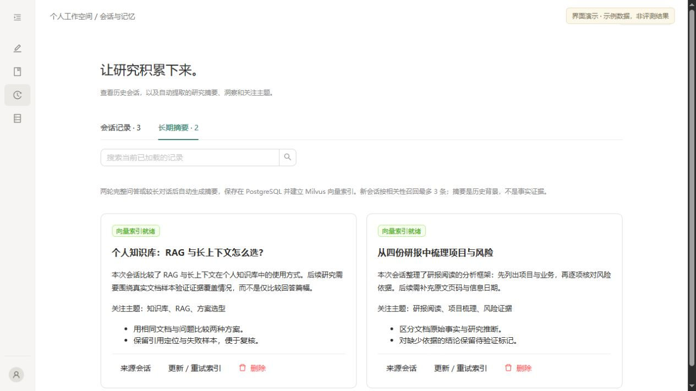

# DeepResearch

**面向行业资料与业务数据的智能调研工作台**

输入研究问题，选择联网搜索、个人知识库或业务数据，获得包含章节、对照表、图表、关系图谱与来源引用的研究结果。系统保留执行过程、已完成章节及审核意见，支持历史研究复用和检查点恢复。

项目重点是研究型 Agent 的工程实现：**组织长任务、约束证据与工具、控制上下文，在模型调用失败后保住已有成果。**

`Python` · `FastAPI` · `asyncio` · `React / TypeScript` · `PostgreSQL` · `Redis` · `Milvus` · `SSE` · `Docker`

[工作流程](#工作流程) · [核心设计](#核心设计) · [代码导航](#代码导航) · [运行与配置](#运行与配置) · [验证与边界](#验证与边界)



> 展示图使用真实前端组件与人工编写的示例数据，不代表模型评测结果。[截图说明](assets/readme/README.md)

## 使用场景

用户在左侧提出问题、追问和观察进度，在右侧集中阅读报告、表格、图表、关系图谱及证据，避免在长对话中寻找研究结果。

| 场景 | 输入示例 | 主要产物 |
| --- | --- | --- |
| 企业与产品比较 | 比较三家云厂商的企业大模型业务，覆盖产品、部署、客户和商业化路径 | 分章分析、核心对照表、带引用的差异与适用条件 |
| 行业专题调研 | 梳理某行业的产业链、竞争格局与风险，区分事实和预测 | 报告、实体关系图谱、证据充分时生成的数据图表 |
| 个人资料研究 | 从上传研报中整理公司项目、业务变化和风险依据 | 限定资料范围的回答、引用与待核查事项 |
| 业务数据探索 | 查询业务表中的行业规模或企业指标，解释差异 | 受限只读 SQL、结果表与分析 |
| 历史研究复用 | 回顾之前研究关注的项目和风险，继续追问 | 完整会话、当前摘要与相关历史摘要 |

知识库提供文档上传、DocMind 解析和向量检索；会话管理保留完整问答；记忆管理支持查看、删除摘要及处理索引状态。数据库探索目前面向内置业务表，并非通用数据库客户端。

## 工作流程



当前主链路是 **自定义 Python 异步状态机，协作调用六类专业 Agent**。角色通过结构化状态交换大纲、事实、来源快照、章节、图表和审核结果；主要阶段按依赖顺序执行。章节检索使用固定并发工作队列，完成一章即可领取下一章，无需等待同批最慢章节。

多 Agent 表示职责、提示词及输出契约的划分，不要求六种不同模型，也不表示所有阶段同时运行。当前生产入口不依赖 LangGraph。

## 核心设计

### 1. 研究任务与网页连接分离

后台异步执行研究，浏览器通过 SSE 订阅进度。关闭页面不会直接取消研究；事件使用递增序号，重新连接可按 `after=N` 补读。

PostgreSQL JSONB 保存阶段检查点及可序列化产物，队列、连接等运行时对象不入库。后端重启后，遗留活动任务标记为 `interrupted`，恢复入口继续已提交阶段；尚未提交的外部请求可能再次执行。报告、终态与结果消息在同一事务写入，通过 `run_id` 避免重复保存结果。

任务区分 `completed`、`partial`、`failed`、`cancelled`、`interrupted` 等状态。完整研究没有总时长上限，但模型请求、工具资源与审核次数各自受限；当前运行时面向单进程部署。

### 2. 长报告分段生成，避免一次输出承载全文

检索与分析按批处理并保留子步骤结果。写作先完成和保存各章，再调用模型生成有限长度的摘要与结尾，由程序组装正文；对比题额外生成核心对照表，归纳最影响选择的差异。

审核修订以片段为单位，纯来源目录由程序原样保留，不交给模型扩写。遇到输出截断，缩小片段后有限重试，已完成章节不被不完整 JSON 覆盖。模型网关记录角色、模型、请求上限、实际 Token、耗时、结束原因与思考模式，区分输出截断、额度不足、参数不兼容和网络超时。

### 3. 图表由证据驱动

```text
来源快照 → 分批提取数据台账 → 绑定实体 / 指标 / 数值 / 单位 / 时间语义
        → 原文核验 → 按同源、同口径记录选图 → 固定模板 → Docker 沙箱
        → 图片 + 核验数据表 + 原文定位；单点记录保留为表格
```

先保存核验通过的数据，再决定画什么图，避免预先设定“三家企业对比”后强凑数据。每批抽取响应有缓存，每张图独立渲染，失败保留已有成果。数据必须绑定实际检索原文；换算记录依据，区分实际值、预测值和目标值。仅标注年份的数据不会补成全年，报价的观察/生效日期不能拿网页发布日期代替。

数据契约和绘图模板支持折线、柱状、横向条形、饼图、环形、分组柱状、百分比堆叠、雷达、散点和热力图。当前自动选图优先使用柱状/条形比较与可核验时点序列，复杂矩阵不会自动补零，雷达图不生成主观评分。**不承诺每份报告都有图或固定图数。** 不完整市场份额保留原百分比，不补造“其他”或重新归一化。

台账保存来源快照摘要指纹与文本/表格定位，前端可以查看单点记录。解析失败、缺少原文、时间不明确、口径冲突、模型抽取失败与沙箱失败分别记录；只有明确缺少来源时才进行有限定向补查，避免因解析器不支持句式而反复搜索。

代码运行于独立 Docker 容器：禁网、非 root、只读根目录，不挂载宿主目录和 Docker socket，不注入密钥，并限制 CPU、内存、进程数及执行时间。沙箱不可用时明确失败，不回退到宿主执行生成代码。

### 4. 审核闭环与可解释的缺口

初审后最多三次补查或修订，根据问题返回检索或写作。通过条件为模型结论 `pass`、评分至少 7 分，且不存在 `critical / major` 问题；结构化报告校验也参与终态判断。

审核要求对齐主体、指标、期间及口径，定位问题原句。来源不足可以记录为研究局限，不能通过虚构来源或数字补齐。达到上限仍未解决的问题随报告保留为 `partial`。模型审核评分用于流程路由，不是准确率。

引用在导出时映射为实际来源编号；数值与引用校验可以发现部分错误，但不等同于完整事实核验。

### 5. Redis + PostgreSQL + Milvus 分层记忆

| 层次 | 职责 | 加载与异常处理 |
| --- | --- | --- |
| PostgreSQL 完整历史 | 保存原始问答，提供会话回看 | 按会话读取；滑动窗口不删除历史 |
| Redis 近期对话 | 缓存最近消息 | 按 Token 估算预算选择窗口，失效回源数据库 |
| PostgreSQL 长期摘要 | 保存摘要、关键洞察、主题及未解决问题 | LLM 增量压缩，失败不推进处理游标 |
| Milvus 摘要索引 | 支持跨会话语义召回 | 按用户过滤，核对版本及删除状态；索引失败可重试 |

模型上下文由近期对话、当前摘要及相关历史摘要共同组成。记忆只作背景，不自动成为事实证据；当前不依赖额外的用户画像功能。

## 代码导航

| 模块 | 入口 |
| --- | --- |
| 生命周期、事件与恢复 | [runtime.py](backend/app/service/assistant/runtime.py) |
| 六角色调度与审核路由 | [full_research.py](backend/app/service/assistant/full_research.py) |
| 模型请求与角色配置 | [llm.py](backend/app/service/assistant/llm.py) · [llm_config.py](backend/app/config/llm_config.py) |
| 专业角色及提示词 | [agents/](backend/app/service/deep_research_v2/agents) |
| 章节组装与片段修订 | [writing_pipeline.py](backend/app/service/deep_research_v2/writing_pipeline.py) |
| 图表台账、选图与数据约束 | [chart_flow.py](backend/app/service/deep_research_v2/chart_flow.py) · [chart_inventory.py](backend/app/service/deep_research_v2/chart_inventory.py) · [chart_contract.py](backend/app/service/deep_research_v2/chart_contract.py) |
| 记忆与上下文 | [memory_context.py](backend/app/service/assistant/memory_context.py) · [memory_store.py](backend/app/service/assistant/memory_store.py) |
| 工具与隔离 | [tools.py](backend/app/service/assistant/tools.py) · [sql_policy.py](backend/app/service/assistant/sql_policy.py) · [sandbox.py](backend/app/service/deep_research_v2/sandbox.py) |
| 前端研究工作台 | [research/](frontend/src/pages/research) |

<details>
<summary>查看研究首页与会话摘要界面</summary>





</details>

## 运行与配置

启停脚本面向 **Windows 本地开发环境**。先准备 Python / Node 依赖、Docker Desktop 与服务配置；依赖清单见 [backend/requirements.txt](backend/requirements.txt) 和 [frontend/package.json](frontend/package.json)。本机路径及启动说明见 [自用启停.md](自用启停.md)。

```powershell
# 从项目根目录执行，保留已有配置
if (!(Test-Path services.local.psd1)) { Copy-Item services.local.example.psd1 services.local.psd1 }
if (!(Test-Path backend/.env)) { Copy-Item backend/.env.example backend/.env }
if (!(Test-Path frontend/.env)) { Copy-Item frontend/.env.example frontend/.env }

# 填写配置，启动 Docker Desktop，再启动 / 停止本项目
powershell -NoProfile -ExecutionPolicy Bypass -File .\start.ps1
powershell -NoProfile -ExecutionPolicy Bypass -File .\stop.ps1
```

前端：[127.0.0.1:5183](http://127.0.0.1:5183/)；后端健康检查：[127.0.0.1:8000/hello](http://127.0.0.1:8000/hello)。停止脚本保留数据卷。

模型、Bocha、DocMind 及 PostgreSQL / Redis / Milvus 参数集中在 [backend/.env.example](backend/.env.example)。DocMind 仅文档解析需要。绘图需先构建沙箱镜像：

```powershell
docker build --pull=false -t industry-research-sandbox:local backend/sandbox
```

**更换模型：** 同一 API 提供方内，可以用脚本修改主模型并重启后端；请在没有活动研究时操作。

```powershell
powershell -NoProfile -ExecutionPolicy Bypass -File .\set-model.ps1 -ModelId 'qwen3.7-plus'
```

搜索角色可在 `backend/.env` 单独设置 `RESEARCH_SEARCH_MODEL`，留空跟随 `OPENAI_MODEL`，例如主模型 Plus、搜索角色 Flash。配置不改变 Bocha 接口，也不改变 Embedding / Rerank 模型。`RESEARCH_ENABLE_THINKING=false` 为当前默认；切换提供方时还需核对 Base URL、密钥、额度及参数支持。

`.env`、本地路径配置、用户资料、运行日志与 `docs/` 不发布到仓库。

## 验证与边界

测试针对执行机制：模型替身制造截断、协议错误与重试场景，真实 Docker 用例验证隔离。2026-09-21 对本次研究修复执行的 **155 项回归测试全部通过，其中 10 项为 Docker 隔离测试**。这不等同于真实研究完成率或报告准确率。

| 验证范围 | 测试入口 |
| --- | --- |
| 角色模型并发隔离、原文引用、份额提取与对照表组装 | [test_quality_upgrade.py](backend/app/scripts/test_quality_upgrade.py) |
| 章节覆盖、审核路由、阶段恢复与取消 | [test_full_research.py](backend/app/scripts/test_full_research.py) |
| 流式响应、输出截断、参数适配与超时 | [test_model_gateway.py](backend/app/scripts/test_model_gateway.py) |
| 长报告组装、片段修订与章节保留 | [test_writing_pipeline.py](backend/app/scripts/test_writing_pipeline.py) |
| 原文绑定、单位期间与逐图恢复 | [test_chart_bindings.py](backend/app/scripts/test_chart_bindings.py) · [test_chart_pipeline.py](backend/app/scripts/test_chart_pipeline.py) |
| 历史回填、摘要游标、用户隔离与索引重试 | [test_layered_memory.py](backend/app/scripts/test_layered_memory.py) |
| 禁网、宿主隔离、只读文件系统与取消清理 | [test_research_sandbox.py](backend/app/scripts/test_research_sandbox.py) |

在已有依赖的 Python 环境中，从项目根目录运行对应脚本：

```powershell
python backend/app/scripts/test_quality_upgrade.py
python backend/app/scripts/test_writing_pipeline.py
python backend/app/scripts/test_research_sandbox.py
```

数据库与记忆测试需要本地服务；沙箱测试使用已有镜像，不自动拉取。[十类图表验收脚本](backend/app/scripts/verify_chart_gallery.py)使用明确标注的测试数据，不消耗模型额度。

- **信息覆盖：** 联网搜索主要通过 Bocha，部分来源只有摘要，不保证全文或付费数据库覆盖。
- **研究质量：** 依赖模型能力与证据质量；尚无固定代表性任务集上的质量、成本和时延基准，不能用单次结果推断整体准确率。
- **业务数据：** Text2SQL 限定 `industry_stats`、`company_data`、`policy_data` 三张业务表及受限语法；演示样本不代表真实业务。
- **部署规模：** 尚未提供分布式任务队列及多工作进程调度，外部请求重试不具备 exactly-once 保证。
